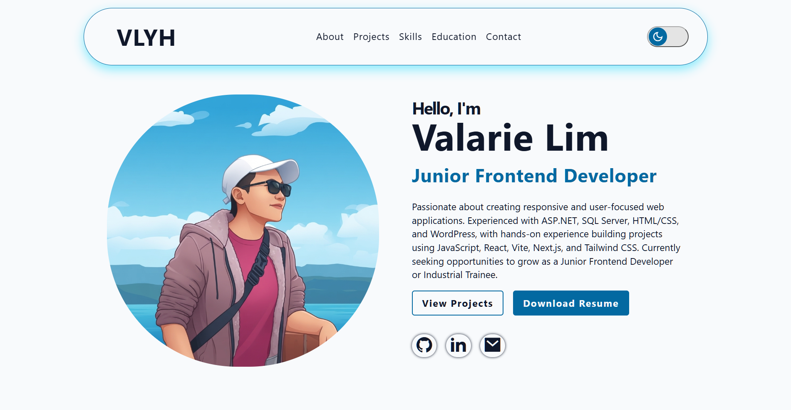
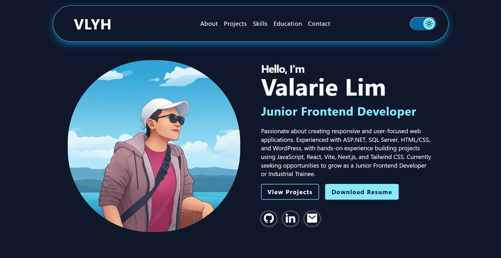

# My Portfolio


A personal portfolio website created to showcase my background, skills, projects, and experience as a Diploma in Information Technology student and junior web developer.

The website was developed using React and Vite with responsive design.

Live Demo  
https://valarie-lim.vercel.app

---

## Website Preview



---

## Project Overview 
This portfolio website was developed as a personal website to introduce myself and showcase my work as a junior web developer. 
The website provides information about my: 
- Personal introduction 
- Education background 
- Technical skills 
- Projects 
- Web development experience 
- Contact information 

The main goal of this project is to create a simple online portfolio that can be shared with potential employers, lecturers, or other people interested in my work.

---

## Key Features
- Personal introduction section
- About me section
- Technical skills section
- Project showcase
- Contact information
- Responsive website layout
- Simple navigation between sections
- Clean and user-friendly interface

---

## Technologies Used
### Frontend
- React
- JavaScript
- HTML
- CSS

### Data & Storage
- JSON
- Web Storage API
- localStorage

### Development Tools
- Vite
- Visual Studio Code
- Git
- GitHub

### Deployment
- Vercel

---

## Project Structure
The project follows a basic React project structure.
```text
portfolio/ 
│ 
├── public/ 
│ 
├── src/ 
│   ├── assets/ 
│   │ 
│   ├── components/ 
│   │   ├── BackToTop.jsx 
│   │   ├── ContactForm.jsx 
│   │   ├── Footer.jsx 
│   │   ├── Header.jsx 
│   │   └── ThemeSwitch.jsx 
│   │ 
│   ├── data/ 
│   │   └── projects.json 
│   │  
│   ├── sections/ 
│   │   ├── About.jsx 
│   │   ├── Contact.jsx 
│   │   ├── Education.jsx 
│   │   ├── Hero.jsx 
│   │   ├── Projects.jsx 
│   │   └── Skills.jsx 
│   │ 
│   ├── App.jsx 
│   ├── main.jsx 
│   └── index.css 
│ 
├── .gitignore 
├── index.html 
├── package.json 
├── package-lock.json 
└── vite.config.js 
```
The src folder contains the main React application files. Components are separated into reusable UI components, while the sections folder contains the main sections of the portfolio website.

---

## Development
The project was created using Vite with React.

To run the project locally, clone the repository and install the required packages.

1. Clone the Repository
git clone https://github.com/valarie-lim/portfolio
2. Open the Project Folder
cd portfolio
3. Install Dependencies
npm install
4. Start the Development Server
npm run dev

The website will then be available on the local development server provided by Vite.
---

## Build for Production
To create a production build:
npm run build

The generated files can then be deployed to a hosting platform such as Vercel.
---

## Deployment
The portfolio website is deployed using Vercel.

Vercel provides hosting for the React application and allows the website to be accessed through the internet.

Live Website 
https://valarie-lim.vercel.app/

---

## Responsive Design
The website is designed to work on different screen sizes, including:
- Desktop
- Laptop
- Tablet
- Mobile devices

Responsive styling helps make the website easier to use on different devices.

---

## What I Learned
Through this project, I gained practical experience in:
- Creating a website using React
- Using Vite for frontend development
- Creating and organizing React components
- Working with JavaScript
- Designing webpages using CSS
- Creating responsive layouts
- Creating light and dark themes
- Using the Web Storage API and localStorage to store user theme preferences
- Using JSON to store project information
- Making project information easier to modify using JSON
- Managing a project using Git and GitHub
- Deploying a website using Vercel
- Building a personal portfolio for job applications

---

## Future Improvements
Some possible improvements for the portfolio include:
- Add more projects
- Improve animations and interactions
- Add a contact form with database integration
- Add more interactive features
- Continue improving the website design and user experience

---

## Author
Valarie Lim  
Diploma in Information Technology
